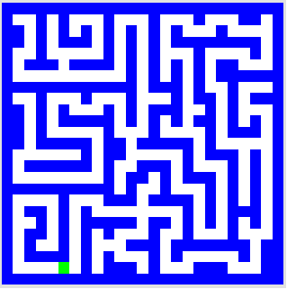

# Picobot
## Homework

In this assignment, you will solve the next two puzzles in Picobot. You do so by writing rules for the picobot such that it fills in all white spaces on the map. You do so regardless of starting position.  

## An Introduction to Picobot 

Slides can be found [here](../slides/picobot.pdf "Picobot slides")

## What you will do

You will solve two puzzles. The first is the maze puzzle: 

## The Maze

 

This one is a bit tricky. You just have to think about it as tracing the edges of the maze, not just running through it.

I believe 8 rules are optimal. If you match this or beat my score, you will receive extra credit! 

## Diamond

This one is a derivation of the empty room puzzle solved during the lab.

My best attempt consists of 10 rules. If you can match me or beat me, you will receive extra credit! 

## Rules

You may work with a partner if you should so choose. Just clearly indicate who you are working with when you submit. Do not spoil the solution of the puzzle for others. All solutions should work regardless of starting position!

Some solutions will be "better" than others. A correct solution that solves the puzzle will receive full credit. However, sometimes programming involves finding solutions that are efficient. In this case, code size! That said, Matching or beating my scores will earn you up to 10% extra credit! 

## Rubric

<table cellspacing="10">
	<tbody>
		<tr>
			<td><b>Points</b></td>
			<td><b>Description</b></td>
		</tr>
		<tr>
			<td align="right">25</td>
			<td>Maze map solved</td>
		</tr>
		<tr>
			<td align="right">25</td>
			<td>Diamond map solved</td>
		</tr>
		<tr>
			<td align="right">2.5</td>
			<td>Bonus: Solution to maze map uses 8 or fewer rules.</td>
		</tr>
		<tr>
			<td align="right">2.5</td>
			<td>Bonus: Solution to diamond map uses 10 or fewer rules.</td>
		</tr>
		<tr>
			<td align="right"><b>50</b></td>
			<td><b>Total</b></td>
		</tr>
	</tbody>
</table>

## Submission

Submission: Submit your solutions as two text files via the dropbox on courseweb. Note in the comments your partner if necessary. That is, if you submit with a partner, you should submit only one copy with names clearly indicated. Grades will be equivalent for you and your partner. If the dropbox does not work for you, you may email the TA your submission.  
