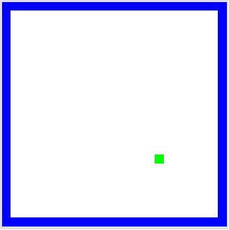
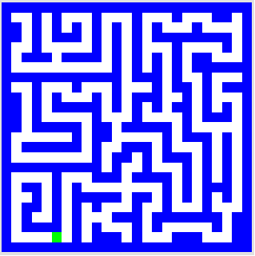

# Picobot
## A Computational Puzzle

In this lab, you will be introduced to the Picobot. It is an interactive tutorial to the principles of computation. Fundamentally, it is a puzzle where you guide Picobot around an empty room and try to give it rules such that it visits every empty space at least once.

## An Introduction to Picobot

Slides: [An Introduction to Picobot](../slides/picobot.pdf "Picobot Slides")

## What to do?

For the lab, complete the first puzzle. It looks like this: 

_You may work with a partner._ **All solutions should work regardless of starting position!**

Note, later you will have homework for the following two puzzles (Press the Map button), so you may want to have a look at them if you finish early.

 

